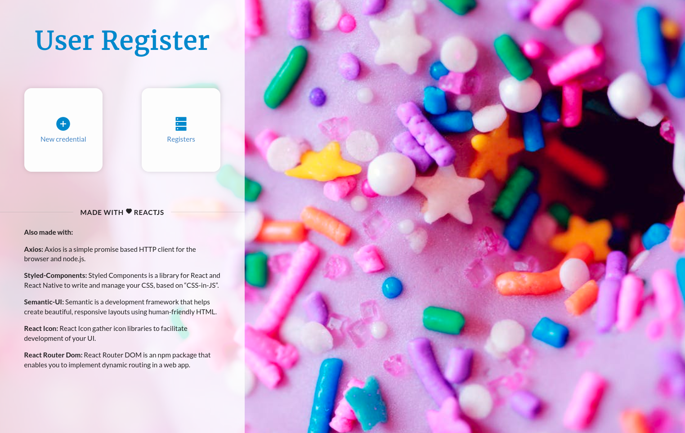
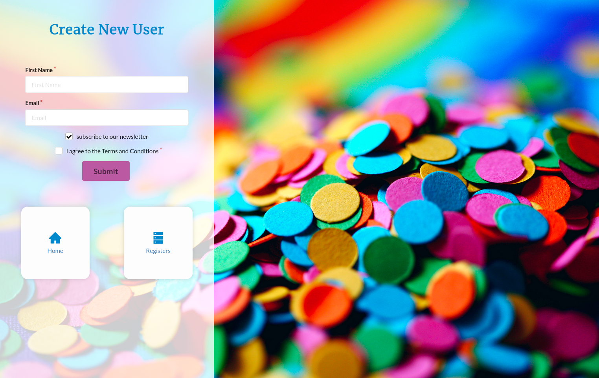
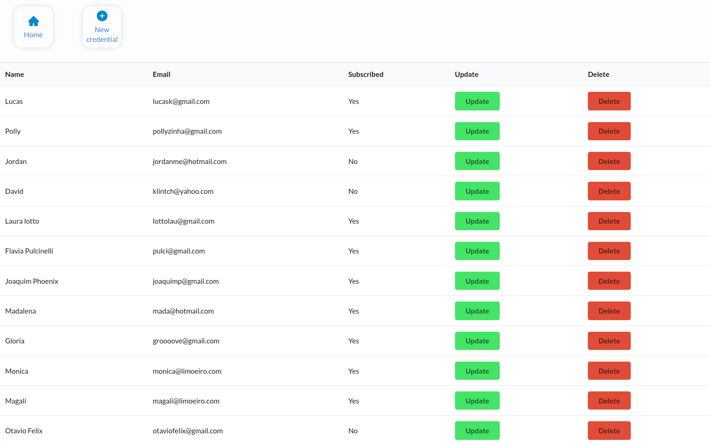
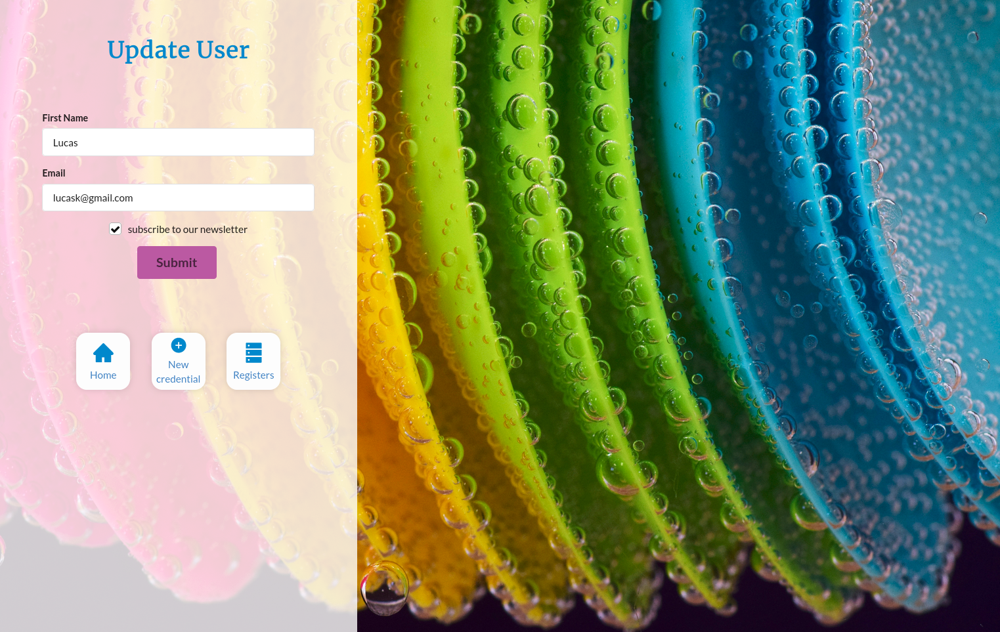

# CRUD em React

## O que é CRUD?

**CRUD - Create Read Update Delete**
É uma sigla que faz referência a um formulário que liga o front-end ao back-end com o uso de API e banco de dados.
Com o CRUD temos o:

- `create` que é a criação de um novo usuário/item/endereço... com um id único. Utiliza o método `post` em requisições http.
- `read` que vai puxar informações criadas que você selecionar ou pesquisar. Utiliza o método `get` em requisições http.
- `update` é o que é usado para alterar alguma informação já criada. Utiliza o método `put` em requisições http.
- `delete` remove o cadastro feito anteriormente. Utiliza o método `delete` em requisições http.

## Backend por MockAPI

De acordo com a própria documentação:

> "MockAPI é uma ferramenta simples que você consegue prototipar facilmente APIs, gerar dados customizados e performar operações usando interface RESTful.  MockAPI é perfeita para ser usado como protótipo, testagem e ferramenta de aprendizado.

*Em tradução livre*

[Link para a ferramenta](https://mockapi.io/docs)

## Style com Styled Components

Styled Components é uma biblioteca pra React que utiliza o conceito de CSS-in-JS que facilita muito o desenvolvimento dos componentes juntamente à estilização.

[Link para a ferramenta](https://styled-components.com/)

## Components com Semantic UI

Semantic UI é um framework front-end que entrega componentes pré-prontos para deixar mais tempo para você se ater às funcionalidades do projeto. 
Semantic UI também te possibilita adicionar elementos no próprio html e não apenas com React.

[Link para a ferramenta](https://react.semantic-ui.com/)

## Promises com Axios

O javascript tem uma ferramenta para lidar com promises na comunicação cliente-servidor que é o **fetch**, porém é muito limitado se comparado ao **Axios**.

[Link para a ferramenta](https://axios-http.com/)

## React Icons

React Icon agrega em si várias bibliotecas de Ícones com facilidade de estilização.

[Link para a ferramenta](https://react-icons.github.io/react-icons/)
